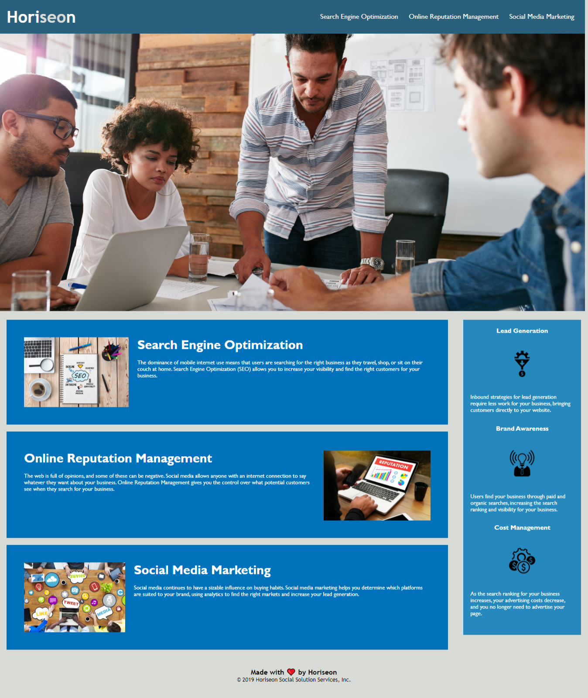

# Horiseon Website Refactor

This project is to refactor the existing Horiseon Services Website.
The goal is to make the website more accessible to developers by removing redundant CSS and change the generic
div elements in the html to semantic elements.

## Final Product
----------
* deployed At : https://bhagatabhijeet.github.io/UCBC-HW-01/index.html
* Git Hub Repo : https://github.com/bhagatabhijeet/UCBC-HW-01
* Final product Image:

* By: [Abhijeet Bhagat ](https://github.com/bhagatabhijeetk)(Git Hub)


---------- 
# Technical Details and Review

## User Story

```
AS A marketing agency
I WANT a codebase that follows accessibility standards
SO THAT our own site is optimized for search engines
```

## Acceptance Criteria

```
GIVEN a webpage meets accessibility standards
WHEN I view the source code
THEN I find semantic HTML elements
WHEN I view the structure of the HTML elements
THEN I find that the elements follow a logical structure independent of styling and positioning
WHEN I view the image elements
THEN I find accessible alt attributes
WHEN I view the heading attributes
THEN they fall in sequential order
WHEN I view the title element
THEN I find a concise, descriptive title
```

## Review

You are required to submit the following for review:

* The URL of the deployed application.

* The URL of the GitHub repository. Give the repository a unique name and include a README describing the project.


- - -
© 2020 Trilogy Education Services, a 2U, Inc. brand. All Rights Reserved.
